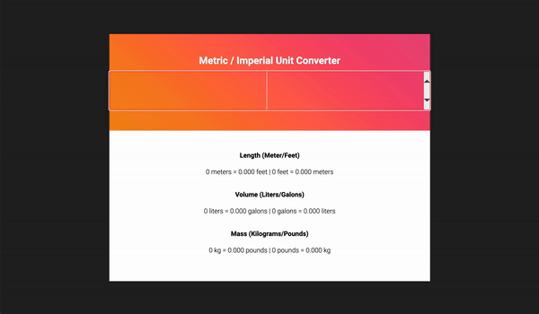

# Unit Converter 🔢

## What is it?

Convert between metric and imperial units easily.
- Includes Length, Volume and Mass.

## Why did I create this?

Because why can't we just stick to imperial unit measurement? I also can never tell how tall a person is when they say "I'm x ft tall."

## How to get it running -

It should be accessible through [here](https://diy-a.github.io/unit-converter)
